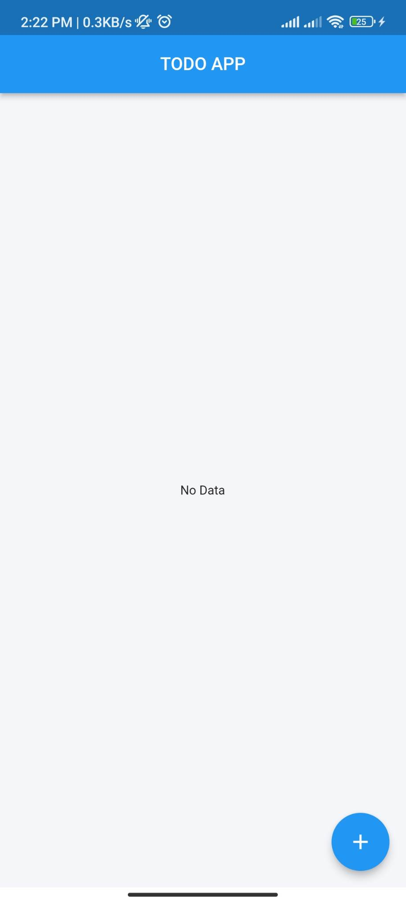
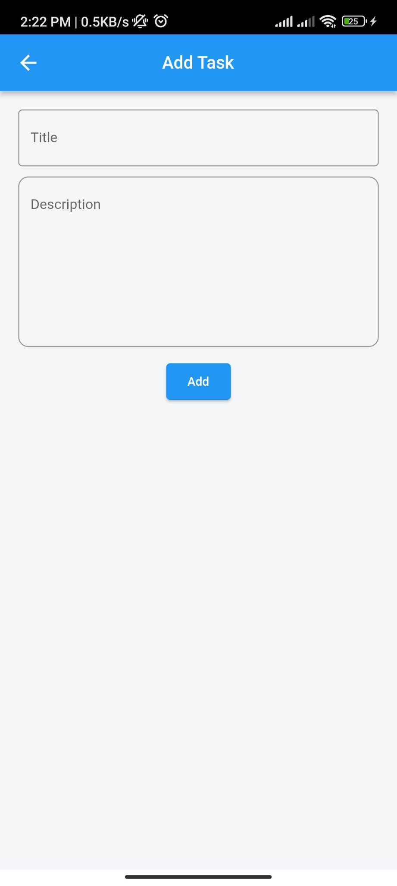
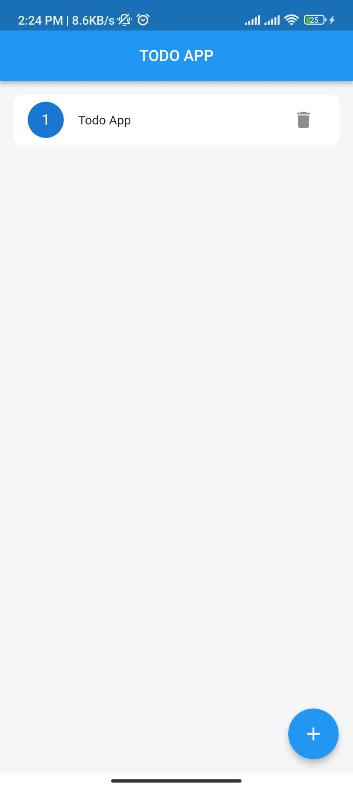
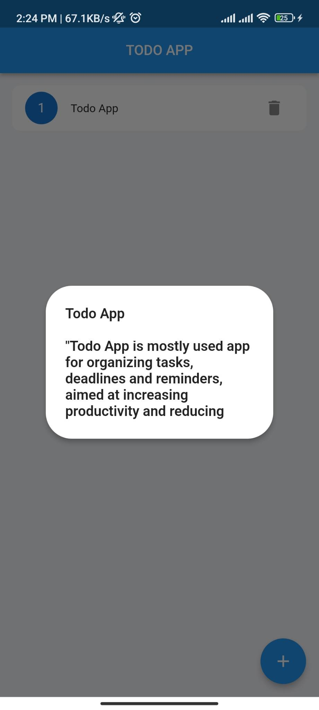

# Todo App

"The Todo App is a popular task management app that helps users organize tasks, deadlines, and reminders. I built this app using Flutter, a User Interface (UI) toolkit, and used Provider (along with RiverPod) for state management. To manage local data storage, I used the Hive package. For handling API requests, I chose to use the Dio package due to its easy-to-use API and powerful interceptor system, which allows for customization and better performance compared to the built-in https package."

## Screenshots

